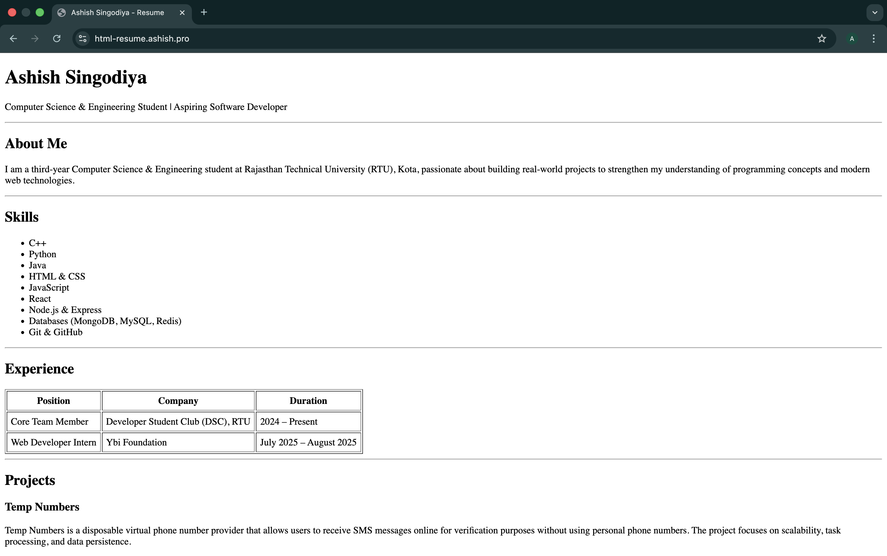

# HTML Resume Assignment

A single-page resume website built using pure HTML, showcasing a professional resume layout with no CSS styling required.

## 🎯 Project Overview

This assignment focuses on building a semantic HTML structure for a personal resume/portfolio page. It demonstrates proper use of HTML elements to create a well-organized, readable resume that includes multiple sections typically found on professional resumes.

**Live Demo:** [https://html-resume.ashish.pro](https://html-resume.ashish.pro)

## 📋 Features

The resume website includes the following sections:

- **Header/Name Section** - Displays name and professional title
- **About Me** - Brief professional introduction
- **Skills List** - Unordered list of technical and professional skills
- **Experience Table** - Organized table showing job history with position, company, and duration
- **Projects** - Descriptions of notable projects with technologies used and timeline
- **Education Table** - Educational background with degree, institution, and year
- **Contact Details** - Email, phone, and location information
- **Footer** - Copyright information

## 🛠️ Tech Stack

- **HTML5** - Semantic markup and structure
- **No CSS** - Pure HTML implementation

## 📦 Setup Instructions

### Prerequisites
- A modern web browser (Chrome, Firefox, Safari, Edge)
- A text editor (VS Code, Sublime Text, etc.) - optional, for editing

### Installation & Usage

1. **Clone or download the repository**
   ```bash
   git clone https://github.com/ashishsingodiya/html-resume-assignment.git
   cd html-resume-assignment
   ```

2. **Open the file**
   - Simply open `index.html` in your web browser
   - Or use a live preview extension by Microsoft in VS Code:
     - Install the "Live Preview" extension
     - Right-click on `index.html` and select "Show Preview"

3. **Customize the content**
   - Edit `index.html` with your own information:
     - Replace the name with your name
     - Update professional title/tagline
     - Add your about me content
     - List your skills
     - Add your work experience
     - Include your projects
     - Add your education details
     - Update contact information

## 📄 File Structure

```
html-resume-assignment/
├── index.html          # Main resume webpage
└── README.md          # This file
```

## ✨ HTML Sections Breakdown

### Header
```html
<header>
        <h1>Ashish Singodiya</h1>
        <p>Computer Science & Engineering | Aspiring Software Developer</p>
        <hr>
    </header>
```

### About Me
```html
<section>
        <h2>About Me</h2>
        <p>
            I am a third-year Computer Science & Engineering student...
        </p>

    </section>
```

### Skills
```html
<section>
    <h2>Skills</h2>
    <ul>
        <li>Skill 1</li>
        <li>Skill 2</li>
    </ul>
</section>
```

### Experience & Education
Uses HTML tables with proper `<thead>` and `<tbody>` structure for organized data presentation.

### Contact
```html
<section>
    <h2>Contact</h2>
    <p>Email: hello@ashish.pro</p>
    <p>GitHub: https://github.com/ashishsingodiya</p>
    <p>Phone: +91 1234567890</p>
    <p>Location: Jaipur, Rajasthan - India</p>
</section>
```

## 🎨 Design Principles

The website follows these principles:

- **Semantic HTML** - Uses proper HTML5 elements (`<header>`, `<section>`, `<footer>`, etc.)
- **Clear Structure** - Logical organization of content with proper heading hierarchy
- **Readability** - Clean, easy-to-read layout with consistent spacing
- **Accessibility** - Proper use of semantic elements for screen readers and accessibility tools
- **Simplicity** - No external dependencies, pure HTML implementation


## 🚀 Deployment Options

### Option 1: Vercel (Recommended)
1. Push your code to a public GitHub repository
2. Connect your repository to [Vercel](https://vercel.com)
3. Vercel automatically deploys on push

### Option 2: GitHub Pages
1. Push your code to a public GitHub repository
2. Go to repository Settings → Pages
3. Select "Deploy from a branch" and choose `main` branch
4. Your site will be available at `https://yourusername.github.io/repository-name`

### Option 3: Netlify
1. Connect your GitHub repository to [Netlify](https://netlify.com)
2. Netlify automatically deploys your site

## 📸 Screenshots

Below are example screenshot of the resume layout:


## 📚 Resources

- [HTML5 Semantic Elements](https://www.w3schools.com/html/html5_semantic_elements.asp)
- [HTML Tables](https://www.w3schools.com/html/html_tables.asp)

## 📝 License

This project is open source and available for educational purposes.